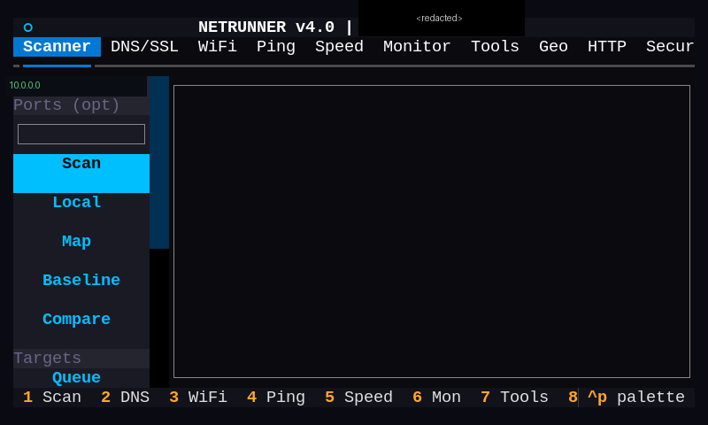

# Cyberboy Customization

Customization scripts and tools for the **Cyberboy** — a homemade cyberpunk-themed
handheld built on a **Raspberry Pi 5** running Debian Trixie / Raspberry Pi OS with
the **labwc** Wayland compositor.

Everything here is fully **offline-first**: local LLMs, offline speech-to-text,
neural TTS, and offline translation all run on-device with no cloud dependency.

## Based on

The **hardware and enclosure** are not my design — they come from
**[Cyberboy v1.0](https://www.thingiverse.com/thing:6921480)**, a Raspberry Pi 5
handheld cyberdeck created by **[rauven](https://www.thingiverse.com/thing:6921480)**
and published on Thingiverse under a Creative Commons license (see the Thingiverse
page for the exact terms). This repository contains **only the software /
customization layer** I built on top of that physical device.

Original project & build write-ups:

- **Thingiverse (print files):** <https://www.thingiverse.com/thing:6921480>
- **Hackster.io:** [Rubfer's 3D-Printed Cyberboy 1.0](https://www.hackster.io/news/rubfer-s-3d-printed-cyberboy-1-0-puts-a-raspberry-pi-5-in-the-palm-of-your-hand-abfa930f15e7)
- **3Druck:** [Cyberboy v1.0 handheld cyberdeck](https://3druck.com/en/diy/cyberboy-v1-0-handheld-cyberdeck-with-raspberry-pi-5-as-a-free-3d-print-template-43155870/)

<!-- Add a photo of your own build here, e.g.: -->
<!--  -->
_Photos of the original design are on the [Thingiverse gallery](https://www.thingiverse.com/thing:6921480)._

> Paths are user-agnostic (`$HOME` / `os.path.expanduser`), so the scripts work
> from any home directory. Some launchers reference sibling tools that live in
> separate repos (e.g. NetRunner v4, `intercept`).

## Screenshots

_More screenshots coming soon._

<!--  -->
<!--  -->
<!--  -->

## Hardware

- **Platform:** Raspberry Pi 5 (arm64), 8 GB RAM
- **Display:** 4.3" DSI touchscreen (800×480), 5-point capacitive multi-touch
- **Desktop:** labwc (Wayland) + `wf-panel-pi`, `foot` terminal
- **Radio:** HackRF One SDR (1 MHz – 6 GHz)
- **Power:** 3S Li-ion with INA219 monitoring

## Tools

### NetRunner — network toolkit
`netrunner.py`, `netrunner.tcss` — a Textual TUI with 16 modules: scanning,
DNS/SSL, WiFi analysis, ping/traceroute, speed tests, connection monitoring,
geolocation, HTTP/security testing, Bluetooth, packet capture, and a rogue-AP
module for **authorized** pentesting.

### CyberRAG — offline retrieval-augmented generation
`cyberrag.py`, `cyberrag`, `cyberrag_popup.sh`, `firstaid_query.sh` — indexes
code, docs, and logs into ChromaDB and answers questions locally via **Ollama**
(default `gemma3:1b`), with an optional Claude CLI engine. Includes a medical /
first-aid mode with emergency-keyword detection and Wikipedia lookup.

### AI DM
`aidm.py`, `aidm` — a local LLM-driven dungeon master / interactive fiction engine.

### Voice input & text-to-speech
- `voice_input.py`, `voice_indicator.py` — offline speech-to-text (faster-whisper)
  with an on-screen listening indicator and spoken command support.
- `speak.sh`, `speak_smart.sh`, `speak_clipboard.sh`, `speak_selection.sh` —
  Piper neural TTS wrappers (multi-language, single-instance).

### Offline translator
`translate.py`, `translate_popup.sh` — bidirectional offline translation
(argostranslate) between English and Spanish, German, French, Chinese, Dutch,
Russian, and Greek, with a wofi/zenity GUI.

### Battery / UPS
`battery_learning.py`, `battery_overlay.py`, `battery_status.py`,
`battery_shutdown.py`, `ups_tray.py` — INA219-based monitoring with EMA voltage
smoothing, a screen overlay, and a system-tray indicator.

### Desktop integration
`command_menu.sh`, `power_menu.sh`, `gestures.sh`, `system_hud.py`,
`screenshot.sh`, `brightness.sh`, `click.sh`, `retro_launcher.sh`,
`offline_status.sh`, `intercept.sh` — launchers, a conky HUD, touchscreen
gesture bindings, and other labwc helpers.

## Requirements

Varies by tool, but broadly: Python 3, a labwc/Wayland session, and utilities
such as `wtype`, `wlrctl`, `wofi`, `zenity`, `conky`, `foot`. LLM tools need
[Ollama](https://ollama.com); voice/TTS need faster-whisper and
[Piper](https://github.com/rhasspy/piper); translation needs argostranslate.

## Disclaimers

- **NetRunner** includes offensive-security modules intended **only** for
  networks you own or are explicitly authorized to test.
- **CyberRAG medical mode** is for informational purposes only and is **not
  medical advice**.

## Not included

Some things are intentionally kept out of the repo (see [`.gitignore`](.gitignore)):
downloaded ML models (Whisper/Piper/Ollama, `*.onnx`, `*.gguf`), the ChromaDB
vector store, Python `__pycache__`, `*.bak` backups, and a nested battery repo.
Install the model dependencies separately per the [Requirements](#requirements)
section.

## License

[MIT](LICENSE)
